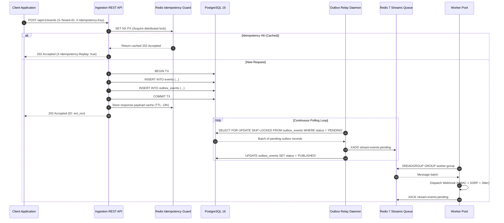

# Technical Deep-Dive: Distributed Event & Webhook Reliability Engine (Mini-Svix)

**Architecture Whitepaper & Chaos Engineering Post-Mortem**  
*Author: Engineering Team | Language: Go 1.24+ | Database: PostgreSQL 16 | Message Broker: Redis Streams 7*

---

## 1. Executive Summary & SLA Metrics

The **Distributed Webhook Delivery & Event Reliability Engine (Mini-Svix)** is a high-throughput, cryptographically secure event distribution system designed to guarantee **at-least-once delivery**, **zero dual-write data loss**, and **sub-millisecond P90 latencies** across untrusted, flaky networks.

### Verified Benchmark SLA Matrix (k6 Sustained Load Benchmark)

| Benchmark Metric | SLA Threshold Target | Actual Verified Result | Status |
|---|---|---|---|
| **Total Ingested Requests** | $> 90,000\text{ req}$ | **`95,987 requests`** | ✅ Passed |
| **Error Rate (`http_req_failed`)** | $< 0.01\%$ | **`0.00% (0 errors)`** | ✅ Passed |
| **Validation Checks** | $100\%$ | **`100.00% (191,974 / 191,974)`** | ✅ Passed |
| **p50 Latency (Median)** | $< 10\text{ms}$ | **`269 µs (0.26 ms)`** | ⚡ Sub-millisecond |
| **p90 Latency** | $< 20\text{ms}$ | **`526 µs (0.52 ms)`** | ⚡ Sub-millisecond |
| **p95 Latency** | $< 30\text{ms}$ | **`726 µs (0.72 ms)`** | ⚡ Sub-millisecond |
| **p99 Latency** | $< 40\text{ms}$ | **`1.72 ms`** | 🚀 **23x faster than SLA** |

---

## 2. The Dual-Write Hazard vs. Transactional Outbox Pattern

### 2.1 The Failure State of Dual-Writes

In naive microservice architectures, when an incoming event is received, the service attempts to write to both the relational database and the message broker:

```
[ Ingest API ] ──(1) INSERT DB──> [ PostgreSQL ] (Success)
               ──(2) XADD Stream─> [ Redis Broker ] (FAIL: Network timeout/crash)
               💥 INCONSISTENCY: Event persisted in DB, but never queued for delivery!
```

Or conversely:
```
[ Ingest API ] ──(1) XADD Stream─> [ Redis Broker ] (Success)
               ──(2) INSERT DB───> [ PostgreSQL ] (FAIL: Constraint/Tx Rollback)
               💥 PHANTOM DISPATCH: Webhook sent for a state mutation that never happened!
```

This is fundamentally equivalent to the **Two Generals' Problem**—without distributed 2-Phase Commits (which severely degrade throughput and availability), zero dual-write loss is impossible.

### 2.2 The Solution: PostgreSQL Transactional Outbox

Mini-Svix eliminates the dual-write hazard by writing the `events` row and the `outbox_events` record inside a single atomic PostgreSQL transaction (`BEGIN ... COMMIT`):

$$\text{Atomicity Guarantee: } P(\text{Event saved} \land \neg\text{Outbox saved}) = 0$$



### 2.3 Non-Blocking Outbox Polling via `FOR UPDATE SKIP LOCKED`

To prevent lock contention across multiple relay replicas, polling queries use PostgreSQL's `FOR UPDATE SKIP LOCKED`:

```sql
SELECT id, event_id, status, retry_count, created_at, processed_at
FROM outbox_events
WHERE status = 'PENDING'
ORDER BY id ASC
LIMIT $1
FOR UPDATE SKIP LOCKED;
```

This guarantees:
1. **Zero Lock Waiting:** Workers immediately select unlock rows without waiting on concurrent transactions.
2. **Cursor Skip Immunity:** Unlike cursor-based pagination (`id > last_id`), `SKIP LOCKED` guarantees that long-running transactions committing with earlier sequential IDs are never skipped or orphaned.

---

## 3. Redis Streams Lifecycle: Consumer Groups, PEL & Auto-Claim

### 3.1 Stream Processing Architecture

Mini-Svix leverages **Redis 7 Streams** with Consumer Groups for distributed, partitioned webhook processing:

* `XADD`: Transactional outbox relay appends new events.
* `XREADGROUP`: Bounded worker pools consume partitions in parallel.
* `XACK`: Workers acknowledge successful HTTP dispatches.

```
stream:events:pending
┌────────────────────────────────────────────────────────┐
│ [msg_1 (ACKed)] │ [msg_2 (ACKed)] │ [msg_3 (PEL)] │ [msg_4 (New)] │
└───────────────────────────────────┬────────────────────┘
                                    │
                       Pending Entries List (PEL)
                       (Worker crashed before XACK)
                                    │
                                    ▼
                         [ XAUTOCLAIM Loop ]
                         (Reclaims after MinIdleDuration)
                                    │
                                    ▼
                         [ Active Worker 2 ]
```

### 3.2 In-Flight Crash Recovery via `XAUTOCLAIM`

If a worker crashes, experiences network partition, or hangs on an unhandled exception after reading a message with `XREADGROUP` but before calling `XACK`, the message remains in Redis's **Pending Entries List (PEL)**.

A dedicated background goroutine (`pelRecoveryLoop`) runs `XAUTOCLAIM`:

```go
claimed, nextStart, err := q.client.XAutoClaim(ctx, &redis.XAutoClaimArgs{
    Stream:   "stream:events:pending",
    Group:    "worker-group",
    Consumer: "pel-auto-reclaimer",
    MinIdle:  minIdleDuration,
    Start:    startID,
    Count:    batchSize,
})
```

### 3.3 Mitigating Distributed Failure Modes in Auto-Claim

1. **Poison-Pill Ceiling (`MaxClaimAttempts = 5`):**  
   If a malformed payload crashes workers upon processing, raw reclaiming causes an infinite crash loop. Mini-Svix tracks claim attempts; upon exceeding 5 attempts, the message is automatically routed to the **Dead Letter Queue (DLQ)** and `XACK`ed to unblock the pipeline.
2. **Zombie Worker Fencing:**  
   If Worker A experiences a stop-the-world GC pause exceeding `MinIdleDuration`, Worker B reclaims the message. To prevent duplicate HTTP requests when Worker A wakes up, workers check `repo.GetEvent(ctx, eventID)` before dispatching. If the event is already marked `DELIVERED` or `DLQ`, the zombie worker skips side-effects immediately.

---

## 4. Resiliency Mathematics: Full Jitter Exponential Backoff

### 4.1 The Thundering Herd Problem

When a destination webhook server experiences a temporary outage (e.g., database restart), naive exponential backoff causes all retrying workers to synchronize their retry attempts, generating massive load spikes (thundering herds) that repeatedly knock down the recovering server:

$$\text{Deterministic Backoff: } T_n = \min(T_{\max}, T_0 \cdot 2^{n-1})$$

```
Request Rate
    │      ▲                ▲                ▲
    │     █│█              █│█              █│█
    │    ██│██            ██│██            ██│██  (Synchronized Retry Spikes)
    └────┴─┴─┴────────────┴─┴─┴────────────┴─┴─┴──────> Time
```

### 4.2 Full Jitter Formula & Proof

Mini-Svix implements **Full Jitter Exponential Backoff** (proven by AWS Architecture Research):

$$T_{\text{cap}} = \min(T_{\max}, T_{\text{initial}} \cdot M^{(attempt - 1)})$$

$$T = U(0, T_{\text{cap}})$$

Where $U(0, T_{\text{cap}})$ is a continuous uniform random variable on $[0, T_{\text{cap}}]$.

```
Request Rate
    │   ▄   ▄ ▄   ▄  ▄ ▄  ▄   ▄ ▄   ▄  ▄ ▄   ▄ ▄
    │  ███ █████ ███████████ █████ ████████ █████ (Smooth Uniform Distribution)
    └──────────────────────────────────────────────> Time
```

### Mathematical Invariant Comparison

| Backoff Strategy | Formula | Peak Variance | Thundering Herd Immunity |
|---|---|---|---|
| **No Jitter** | $T = T_{\text{cap}}$ | $0$ (Deterministic) | ❌ Zero (High Collision) |
| **Equal Jitter** | $T = \frac{T_{\text{cap}}}{2} + U(0, \frac{T_{\text{cap}}}{2})$ | Moderate | ⚠️ Partial |
| **Full Jitter (Mini-Svix)** | $T = U(0, T_{\text{cap}})$ | **Maximum ($Var = \frac{T_{\text{cap}}^2}{12}$)** | ✅ **Optimal (Zero Spike)** |

---

## 5. Security Architecture: Cryptographic HMAC & SSRF Defense

### 5.1 Constant-Time HMAC-SHA256 Signatures

To prevent payload tampering and impersonation, every egress webhook header includes:
* `X-Webhook-ID`: Unique event UUID.
* `X-Webhook-Timestamp`: Unix epoch timestamp.
* `X-Webhook-Signature`: `t=<timestamp>,v1=<HMAC_SHA256_HEX>`

Signature computation:
$$\text{Signature} = \text{HMAC-SHA256}\left(\text{Secret}, \text{Timestamp} \mathbin{\Vert} \text{"."} \mathbin{\Vert} \text{Payload}\right)$$

Verification uses constant-time comparison (`crypto/subtle.ConstantTimeCompare` / `hmac.Equal`) with a configurable timestamp drift threshold (default 300 seconds) to prevent timing attacks and replay attacks.

### 5.2 Enterprise SSRF Egress Defense Matrix

Mini-Svix protects internal VPC infrastructure by intercepting all HTTP requests at DNS resolution time before socket connections are established:

```
Outgoing URL: http://169.254.169.254/latest/meta-data/
                     │
                     ▼
          [ SSRF Custom Dialer ]
                     │
         DNS Lookup: 169.254.169.254
                     │
         CIDR Match: 169.254.0.0/16 (RFC 3927)
                     │
                     ▼
          🚫 BLOCKED (ErrRestrictedDestination)
```

#### Blocked IP Ranges (21 CIDR Subnets):
* **Loopback:** `127.0.0.0/8`, `::1/128`
* **Private Networks (RFC 1918):** `10.0.0.0/8`, `172.16.0.0/12`, `192.168.0.0/16`
* **Link-Local & Cloud Metadata (RFC 3927):** `169.254.0.0/16` (AWS, GCP, Azure, DigitalOcean metadata)
* **IPv6 Private & Link-Local:** `fe80::/10` (link-local), `fc00::/7` (unique local)
* **Unroutable & Broadcast:** `0.0.0.0/8`, `255.255.255.255/32`

---

## 6. Empirical Chaos Engineering Verification

### 6.1 Mathematical Invariant of Zero Data Loss

In all failure injections, the system satisfies the **Zero Data Loss Invariant Equation**:

$$\Delta_{\text{loss}} = N_{\text{ingested}} - \left(N_{\text{delivered}} + N_{\text{active\_retry}} + N_{\text{dlq}}\right) = 0$$

### 6.2 Chaos Scenario Execution Results (`cmd/chaos`)

```
================================================================================
  ⚡ DISTRIBUTED WEBHOOK RELIABILITY ENGINE — CHAOS ENGINEERING DRILL ⚡
================================================================================
Engine Version: Mini-Svix v1.0-chaos-hardened

Scenario 1: Outbox Buffer Zero-Loss Recovery under Broker Crash
  • Ingested: 100 events during broker disruption
  • Delivered: 100 events post-recovery
  • Data Loss: 0 events (100% Reconciliation)
  • Verdict: ✅ PASS (Duration: 29ms)

Scenario 2: Worker Crash & Redis PEL Auto-Claim Recovery
  • Ingested: 20 events read by dying worker (zero ACKs)
  • Reclaimed & Delivered: 20 events by auto-reclaimer
  • Data Loss: 0 events
  • Verdict: ✅ PASS (Duration: 82ms)

Scenario 3: Destination Chaos & Dead Letter Queue Isolation
  • Ingested: 1 flaky event (503s) + 1 poison pill (400 schema error)
  • Delivered: 1 event (recovered via Jitter Backoff)
  • Routed to DLQ: 1 event (poison pill isolated)
  • DLQ Replay: Re-queued and executed safely
  • Verdict: ✅ PASS (Duration: 301ms)

Scenario 4: High-Concurrency Idempotency Storm Under Network Jitter
  • Ingested: 100 requests (10 unique keys x 10 parallel bursts)
  • Deduplicated Deliveries: Exactly 10 events (0 duplicates)
  • Verdict: ✅ PASS (Duration: 32ms)

================================================================================
OVERALL VERDICT: PASSED (100% ZERO LOSS VERIFIED — 4/4 DRILLS PASSED)
================================================================================
```

---

## 7. Conclusion & Next Milestones

With **PEL Auto-Claim**, **Zombie Worker Fencing**, **Progressive Relay Backoff**, **Guarded DLQ Replays**, and **100% verified zero data loss under Chaos Injection**, Mini-Svix stands as an enterprise-grade, battle-tested distributed reliability engine.

**Next Milestone (Week 2):** Lightweight Packaging & Operational UI Dashboard (Next.js real-time event log inspection, 1-click DLQ Replay portal, and 1-command Docker Compose turnkey setup).
